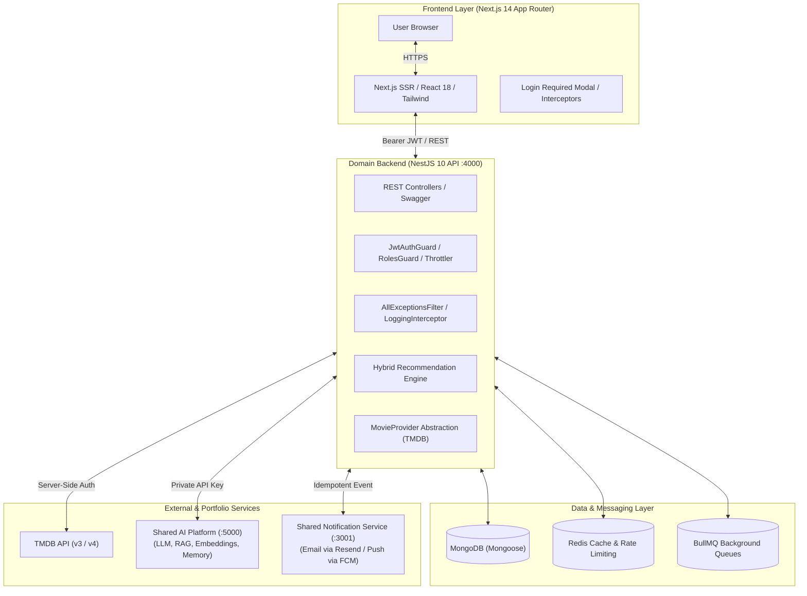
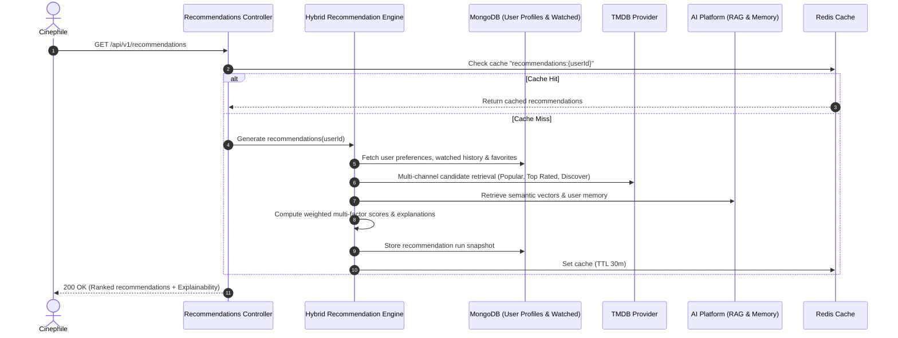

# 🎬 CineMatch AI — Production-Grade AI Movie Discovery & Hybrid Recommendation System

[](https://github.com/rishank-kesarwani/ai-movie-matcher/actions)
[](https://www.typescriptlang.org/)
[](https://nextjs.org/)
[](https://nestjs.com/)
[](https://mongoosejs.com/)
[](https://redis.io/)
[](https://docs.bullmq.io/)

> **Flagship AI Application** in the AI Engineering Portfolio.  
> Engineered from the ground up following clean architecture principles, decoupled microservices, hybrid multi-factor recommendation algorithms, vector semantic search, explainable AI, asynchronous BullMQ queues, and robust auth with refresh token rotation.

---

## 📑 Table of Contents
1. [Overview & Highlights](#-overview--highlights)
2. [System Architecture (HLD)](#-system-architecture-hld)
3. [Hybrid Recommendation Engine Architecture](#-hybrid-recommendation-engine-architecture)
4. [Semantic Movie Search & Embeddings](#-semantic-movie-search--embeddings)
5. [Conversational AI Assistant (CineMatch AI)](#-conversational-ai-assistant-cinematch-ai)
6. [TMDB Provider Abstraction & Attribution](#-tmdb-provider-abstraction--attribution)
7. [Microservice Ecosystem Integration](#-microservice-ecosystem-integration)
8. [Authentication & Security Flow](#-authentication--security-flow)
9. [Login-Required UX & Error Resilience](#-login-required-ux--error-resilience)
10. [Database Schemas & Indexing Strategy](#-database-schemas--indexing-strategy)
11. [Redis Caching & Asynchronous Queues](#-redis-caching--asynchronous-queues)
12. [REST API Specification](#-rest-api-specification)
13. [Local Development & Docker Setup](#-local-development--docker-setup)
14. [Testing Strategy](#-testing-strategy)
15. [Deployment Guide](#-deployment-guide)
16. [Observability, Cost Control & Health Checks](#-observability-cost-control--health-checks)

---

## 🌟 Overview & Highlights

**AI Movie Matcher** (`ai-movie-matcher`) is a full-stack, enterprise-grade AI movie discovery and recommendation platform. It solves the fatigue of browsing endless streaming catalogs by translating human moods, themes, and nuanced preferences into precise film matches with non-hallucinatory explanations.

### Key Capabilities:
- **Hybrid AI Recommendation Engine**: Balances semantic similarity, explicit taste parameters, implicit viewing habits, TMDB critical ratings, and popularity curves using transparent weighted scoring.
- **Natural Language Semantic Search**: Matches concepts (e.g. *"I want a feel-good movie about friendship and road trips"*) without requiring exact title or keyword matches.
- **Conversational AI Film Assistant**: Interactive multi-turn dialogue with context memory (e.g. *"Something like Interstellar but less serious and under 2 hours"*).
- **Explainable AI Matching**: Every recommendation breaks down why it was picked using verified metadata (themes, directors, cast, critical consensus).
- **Decoupled Portfolio Architecture**: Integrates cleanly with shared [`ai-platform`](https://github.com/rishank-kesarwani/ai-platform) and [`notification-service`](https://github.com/rishank-kesarwani/notification-service) engines.
- **Production Hardened**: Token rotation, hashed secrets, circuit breaker fallbacks, Rate limiting, Redis multi-tier caching, BullMQ asynchronous jobs, and zero generic error mappings.

---

## 🏗️ System Architecture (HLD)



---

## 🧮 Hybrid Recommendation Engine Architecture

Rather than relying on black-box heuristics or pure vector cosine distance, CineMatch AI computes a deterministic multi-signal hybrid score:

$$\text{FinalScore} = \left( w_1 \cdot S_{\text{pref}} + w_2 \cdot S_{\text{semantic}} + w_3 \cdot S_{\text{rating}} + w_4 \cdot S_{\text{pop}} \right) \times 100 \times M_{\text{watched}}$$

Where:
- $S_{\text{pref}}$: Explicit genre alignment + favorite director/actor overlap + disliked genre penalty.
- $S_{\text{semantic}}$: Vector similarity and theme match between user taste profile and film narrative.
- $S_{\text{rating}}$: Verified TMDB critical and audience vote average normalized to $[0, 1]$.
- $S_{\text{pop}}$: Logarithmic popularity score $\min(1, \frac{\log_{10}(\text{pop})}{3})$.
- $M_{\text{watched}}$: De-boost modifier for already-seen films ($0.85$ unless requested).
- Configurable default weights: $w_1 = 0.35, w_2 = 0.30, w_3 = 0.20, w_4 = 0.15$.



---

## 🔍 Semantic Movie Search & Embeddings

Users can query the catalog using unstructured concepts or moods:
- *"Mind-bending sci-fi with philosophical questions and unexpected twists"*
- *"Feel-good animated movie about friendship and journey"*

The query is dispatched to the **AI Platform** `/v1/rag/query` & `/v1/embeddings` endpoint, matching against movie synopsis embeddings and thematic metadata to rank the most relevant cinematic candidates.

---

## 🤖 Conversational AI Assistant (CineMatch AI)

Integrated with the shared AI Platform, the conversational assistant maintains dialogue context across turns:
1. **Turn 1**: *"Give me 5 movies for a Friday night."*
2. **Turn 2**: *"Nothing longer than 2 hours."*
3. **Turn 3**: *"Something with great cinematography."*

The assistant returns structured movie suggestions enriched in real-time with verified TMDB posters, ratings, and runtime details.

---

## 🎬 TMDB Provider Abstraction & Attribution

The application decouples external movie fetching through the `MovieProvider` interface:

```typescript
export interface MovieProvider {
  searchMovies(query: string, filter?: MovieSearchFilterDto): Promise<PaginatedMovieResultDto>;
  getMovieDetails(movieId: number): Promise<MovieDetailDto | null>;
  getMovieCredits(movieId: number): Promise<MovieCreditsDto>;
  getSimilarMovies(movieId: number, page?: number): Promise<PaginatedMovieResultDto>;
  getTrendingMovies(timeWindow?: 'day' | 'week', page?: number): Promise<PaginatedMovieResultDto>;
  getPopularMovies(page?: number): Promise<PaginatedMovieResultDto>;
  getTopRatedMovies(page?: number): Promise<PaginatedMovieResultDto>;
  getUpcomingMovies(page?: number): Promise<PaginatedMovieResultDto>;
  discoverMovies(filter: MovieSearchFilterDto): Promise<PaginatedMovieResultDto>;
  getGenres(): Promise<GenreDto[]>;
}
```

### 📢 TMDB Attribution Notice
> **Notice**: This product uses the TMDB API but is not endorsed or certified by TMDB.  
> All movie posters, images, synopses, and metadata are served directly from The Movie Database (TMDB) with proper server-side token isolation.

---

## 🌐 Microservice Ecosystem Integration

### 1. Shared AI Platform Integration (`ai-platform`)
- **Repository**: [`github.com/rishank-kesarwani/ai-platform`](https://github.com/rishank-kesarwani/ai-platform)
- **Role**: Shared LLM reasoning, RAG ingestion, embeddings, and context memory.
- **Client**: `AiPlatformClient` communicating over internal REST with `x-api-key`.
- **Cost Observability**: `AiCostTrackerService` records token consumption, model types, latency, and estimated USD costs.

### 2. Shared Notification Engine (`notification-service`)
- **Repository**: [`github.com/rishank-kesarwani/notification-service`](https://github.com/rishank-kesarwani/notification-service)
- **Role**: Dual-channel (Email & Push) notifications for welcome events, password resets, watchlist releases, and weekly AI recommendation digests.
- **Client**: `NotificationClientService` with idempotency keys (`idempotencyKey: notif_user_timestamp`) to ensure zero duplicated deliveries.

---

## 🔐 Authentication & Security Flow

- **Passwords**: Hashed with `bcryptjs` (salt rounds: 10).
- **Access Tokens**: Short-lived JWTs (15 minutes).
- **Refresh Tokens**: Long-lived JWTs (7 days) with **rotation**:
  - Each refresh generates a new access token AND a new rotated refresh token.
  - Refresh tokens are hashed before storage in MongoDB to protect against database leak compromises.
- **Forgot Password**: Generates a cryptographically random 32-byte token (`crypto.randomBytes`), stores its SHA-256 hash in DB with 1-hour expiration, and dispatches the plain token in a reset link via `NotificationService`.
- **Zero Email Enumeration**: Returns generic message `"If an account exists with this email, a password reset link has been sent."` regardless of user existence.

---

## 🛡️ Login-Required UX & Error Resilience

Protected actions gracefully trigger the **Login Required Modal** rather than throwing generic errors:
- Add / remove from watchlist
- Rate movie / submit reviews
- Add to favorites
- Personalized AI recommendations
- AI Assistant chat
- Preference management

### Centralized Error Code Mapping
| Status Code | Error Code | Client UI Experience |
|---|---|---|
| `401` | `AUTHENTICATION_REQUIRED` | Automatic token refresh or opens **Login Required Modal** |
| `403` | `PERMISSION_DENIED` | Shows privilege explanation toast |
| `404` | `RESOURCE_NOT_FOUND` | Empty state / 404 message |
| `409` | `RESOURCE_CONFLICT` | Conflict warning (e.g. Email already exists) |
| `422` | `VALIDATION_FAILED` | Form validation indicator |
| `429` | `RATE_LIMIT_EXCEEDED` | "Rate limit exceeded. Please wait a moment." |
| `5xx` | `INTERNAL_SERVER_ERROR` | Fallback cache / graceful degradation |

---

## 🗄️ Database Schemas & Indexing Strategy

| Collection | Schema Model | Indexes | Purpose / Justification |
|---|---|---|---|
| `users` | `User` | `{ email: 1 }` (unique)<br>`{ passwordResetTokenHash: 1 }` | Fast authentication lookups and O(1) password reset token resolution. |
| `userpreferences` | `UserPreference` | `{ userId: 1 }` (unique) | Immediate taste profile loading during recommendation calculation. |
| `watchlistitems` | `WatchlistItem` | `{ userId: 1, movieId: 1 }` (unique)<br>`{ userId: 1, createdAt: -1 }` | Prevents duplicate watchlist entries; enables fast user library queries. |
| `watchedmovies` | `WatchedMovie` | `{ userId: 1, movieId: 1 }` (unique)<br>`{ userId: 1, watchedAt: -1 }` | Prevents duplicate logs; rapid chronologically sorted viewing history. |
| `movieratings` | `MovieRating` | `{ userId: 1, movieId: 1 }` (unique)<br>`{ movieId: 1 }` | Enables fast rating checks and movie community score aggregation. |
| `favorites` | `Favorite` | `{ userId: 1, type: 1, itemId: 1 }` (unique)<br>`{ userId: 1, type: 1 }` | Unique favoriting per item type (Movie, Genre, Actor). |
| `recommendations` | `Recommendation` | `{ userId: 1, createdAt: -1 }` | Recommendation run history and analytics. |

---

## ⚡ Redis Caching & Asynchronous Queues

### Multi-Tier Redis Caching
- `movie:trending:{timeWindow}:{page}` — TTL: 1 hour
- `movie:popular:{page}` — TTL: 1 hour
- `movie:top_rated:{page}` — TTL: 6 hours
- `movie:details:{movieId}` — TTL: 12 hours
- `movie:genres` — TTL: 24 hours
- `movie:search:{hash}` — TTL: 30 minutes
- `recommendations:{userId}:{hash}` — TTL: 30 minutes

### BullMQ Background Queues
- **`movie-recommendation-queue`**: Handles background recommendation generation and notification delivery.
- **`movie-notification-queue`**: Handles asynchronous dual-channel notification dispatch.
- **Resilience**: Configured with 3 attempts, exponential backoff ($2000\text{ms}$ base delay), and Dead Letter Queue (DLQ) tracking.

---

## 📋 REST API Specification

### Authentication (`/api/v1/auth`)
- `POST /api/v1/auth/register` — Register new user account
- `POST /api/v1/auth/login` — Log in and receive access + refresh token
- `POST /api/v1/auth/refresh` — Rotate refresh token and get new access token
- `POST /api/v1/auth/logout` — Invalidate refresh token and logout
- `GET /api/v1/auth/me` — Retrieve current authenticated profile
- `POST /api/v1/auth/forgot-password` — Request cryptographic password reset link
- `POST /api/v1/auth/reset-password` — Complete password reset with token

### Movies & Discovery (`/api/v1/movies`)
- `GET /api/v1/movies/trending` — Get trending movies
- `GET /api/v1/movies/popular` — Get popular movies
- `GET /api/v1/movies/top-rated` — Get top rated movies
- `GET /api/v1/movies/upcoming` — Get upcoming releases
- `GET /api/v1/movies/genres` — Get list of official genres
- `GET /api/v1/movies/search?q=...` — Search movies by title/keyword
- `GET /api/v1/movies/discover` — Discover movies with multi-criteria filters
- `GET /api/v1/movies/:id` — Get movie details, credits, and trailers
- `GET /api/v1/movies/:id/credits` — Get cast and crew
- `GET /api/v1/movies/:id/similar` — Get similar movies

### AI Platform & Recommendations (`/api/v1/recommendations` & `/api/v1/ai`)
- `GET /api/v1/recommendations` — Get personalized AI recommendations
- `POST /api/v1/recommendations/generate` — Force generate recommendations & notify
- `GET /api/v1/recommendations/history` — Get recommendation run history
- `POST /api/v1/ai/chat` — Conversational AI Assistant
- `POST /api/v1/ai/semantic-search` — Semantic natural language search
- `GET /api/v1/ai/usage` — AI token usage and cost observability summary

### Library & Preferences (`/api/v1/watchlist`, `/api/v1/watched`, `/api/v1/favorites`, `/api/v1/preferences`)
- `GET /api/v1/watchlist` & `POST /api/v1/watchlist` & `DELETE /api/v1/watchlist/:id`
- `GET /api/v1/watched` & `POST /api/v1/watched` & `DELETE /api/v1/watched/:id`
- `POST /api/v1/movies/:id/rating` & `GET /api/v1/movies/:id/rating`
- `GET /api/v1/favorites` & `POST /api/v1/favorites` & `DELETE /api/v1/favorites/:type/:id`
- `GET /api/v1/preferences` & `PUT /api/v1/preferences`

---

## 💻 Local Development & Docker Setup

### Prerequisites
- Node.js 20+
- MongoDB 7.0+
- Redis 7.0+

### Option A: Running with Docker Compose
```bash
# 1. Clone repository
git clone https://github.com/rishank-kesarwani/ai-movie-matcher.git
cd ai-movie-matcher

# 2. Configure environment
cp .env.example .env

# 3. Start full stack (MongoDB, Redis, Backend, Frontend)
docker-compose up --build
```
- Frontend: `http://localhost:3000`
- Backend API: `http://localhost:4000`
- Swagger Docs: `http://localhost:4000/api/docs`

### Option B: Running Services Locally
```bash
# Backend
cd backend
npm install --legacy-peer-deps
npm run start:dev

# Frontend
cd ../frontend
npm install --legacy-peer-deps
npm run dev
```

---

## 🧪 Testing Strategy

All backend and frontend test suites are fully automated:

```bash
# Run Backend Unit Tests (26 tests)
cd backend && npm test

# Run Frontend Component Tests
cd frontend && npm test
```

### Coverage Highlights:
- **AuthService**: Register, login, refresh token rotation, password hashing, token verification, forgot/reset password flows.
- **UsersService**: Duplicate email prevention, refresh token updates.
- **MoviesService**: Multi-tier Redis caching and TMDB fallback handling.
- **RecommendationsEngineService**: Multi-signal hybrid score calculations, weight tuning, explainability text generation.
- **NotificationService**: Dual-channel email and push dispatches.
- **RolesGuard**: Role-based access control.
- **Frontend**: `LoginRequiredModal`, `MatchScoreBadge`, API error formatters.

---

## 🚀 Deployment Guide

### Backend on Railway
1. Create a new project in [Railway](https://railway.app/).
2. Attach a MongoDB database and a Redis database via Railway plugins.
3. Deploy the `backend/` directory as a Node.js web service.
4. Set environment variables (`JWT_ACCESS_SECRET`, `JWT_REFRESH_SECRET`, `TMDB_ACCESS_TOKEN`, `AI_PLATFORM_URL`, `NOTIFICATION_SERVICE_URL`).
5. Expose public HTTPS domain.

### Frontend on Vercel
1. Import repository in [Vercel](https://vercel.com/).
2. Set Root Directory to `frontend`.
3. Set `NEXT_PUBLIC_API_URL=https://your-railway-backend.railway.app/api/v1`.
4. Deploy!

---

## 📊 Observability, Cost Control & Health Checks

- **Liveness Probe**: `GET /health`
- **Readiness Probe**: `GET /health/ready` (validates MongoDB, Redis, AI Platform, and Notification Service)
- **AI Observability**: `GET /api/v1/ai/usage` tracks request counts, token consumption, latency, and estimated USD cost.
- **Structured Logs**: Pino/Winston logging with unique `x-request-id` header tracing across microservices.

---

## 👤 Author & Engineering Portfolio

**Rishank Kesarwani**  
Senior AI & Full-Stack Engineer  
- GitHub: [@rishank-kesarwani](https://github.com/rishank-kesarwani)
- Reference Architectures:
  - [`ai-platform`](https://github.com/rishank-kesarwani/ai-platform)
  - [`notification-service`](https://github.com/rishank-kesarwani/notification-service)
  - [`ai-travel-planner`](https://github.com/rishank-kesarwani/ai-travel-planner)
